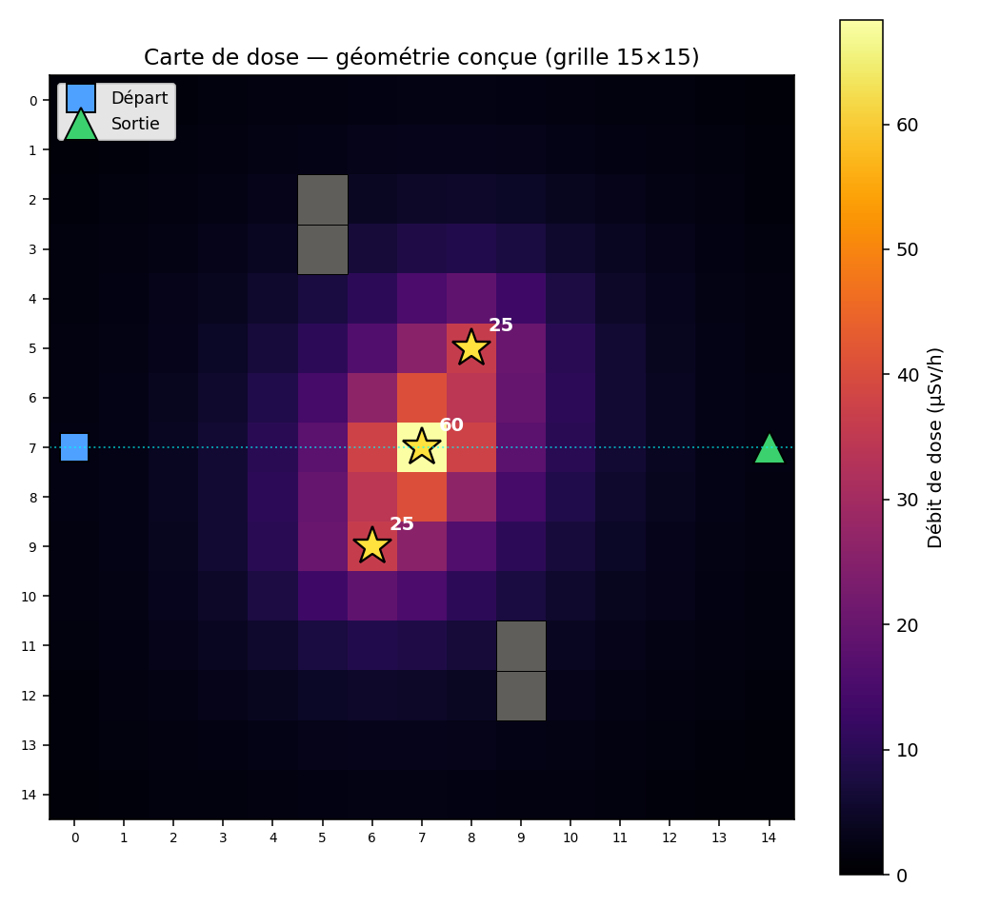

# Navigation d'un agent en zone irradiée par Reinforcement Learning (principe ALARA)

> Projet de Master 2 — Intelligence Artificielle · Cours de Reinforcement Learning

Un agent apprend, par essais-erreurs, à évacuer une zone contenant des sources
radioactives en suivant le chemin qui **minimise la dose de radiation reçue** tout en
atteignant la sortie dans un temps raisonnable — l'application directe du principe
**ALARA** (*As Low As Reasonably Achievable*). L'algorithme central est un
**Deep Q-Network (DQN)**, comparé à une politique aléatoire et à un Q-learning tabulaire,
avec monitoring Weights & Biases et une démo interactive (Gradio / Streamlit).

---

## Table des matières

1. [Idée du projet](#1-idée-du-projet)
2. [Origine et simulation des données](#2-origine-et-simulation-des-données)
3. [Le problème formalisé (MDP)](#3-le-problème-formalisé-mdp)
4. [La géométrie de l'environnement](#4-la-géométrie-de-lenvironnement)
5. [Structure du dépôt](#5-structure-du-dépôt)
6. [Les cinq étapes du projet](#6-les-cinq-étapes-du-projet)
7. [Installation](#7-installation)
8. [Comment tout lancer](#8-comment-tout-lancer)
9. [Partie 1 — L'environnement (`env_alara.py`)](#9-partie-1-lenvironnement-env_alarapy)
10. [Partie 2 — L'agent DQN (`dqn.py`, `train.py`)](#10-partie-2-lagent-dqn-dqnpy,-trainpy)
11. [Partie 3 — Le monitoring (`monitoring.py`)](#11-partie-3-le-monitoring-monitoringpy)
12. [Partie 4 — Les comparaisons (`baselines.py`, `evaluate.py`)](#12-partie-4-les-comparaisons-baselinespy,-evaluatepy)
13. [Partie 5 — Le déploiement (Gradio & Streamlit)](#13-partie-5-le-déploiement-gradio-streamlit)
14. [Résultats](#14-résultats)
15. [Notes pour le rapport](#15-notes-pour-le-rapport)
16. [Références](#16-références)

---

## 1. Idée du projet

Dans une évacuation d'urgence (accident en laboratoire, incident en installation
nucléaire), le chemin le plus court n'est pas toujours le plus sûr : filer tout droit
peut traverser une zone très irradiée, tandis qu'un détour réduit la dose au prix de
quelques secondes. On simule ce dilemme dans une grille 2D et on entraîne un agent à
trouver le bon compromis — sans jamais lui montrer la solution.

En Reinforcement Learning, **il n'y a aucun jeu de données à télécharger** : les données
d'entraînement (les transitions état → action → récompense → nouvel état) sont générées
par l'agent lui-même en interagissant avec l'environnement simulé.

---

## 2. Origine et simulation des données

C'est une spécificité du projet qu'il faut bien comprendre : **nous ne simulons pas un
jeu de données, nous simulons un environnement qui produit les données par interaction.**
La distinction est importante.

### Pourquoi il n'y a pas de dataset

En apprentissage supervisé, on part d'un fichier d'exemples déjà étiquetés (des images,
des mesures…). Ici, un tel fichier n'existe pas et ne pourrait pas exister : il n'y a
aucune base de « bons chemins d'évacuation en zone irradiée » à télécharger. Les données
sont donc **générées à la volée** par l'agent, à mesure qu'il explore.

### Le type de simulation employé

L'environnement est un **simulateur déterministe à base physique**, de type *grid world*
(monde en grille), conforme à l'interface Gymnasium. Trois composantes le définissent :

1. **Un modèle physique de la dose.** La carte de débit de dose n'est pas tirée au hasard :
   elle est calculée par une loi physique, celle de l'inverse du carré de la distance,
   `dose(p) = Σₖ Iₖ / (dₖ² + 1)`, sommée sur les 3 sources. C'est ce qui ancre la
   simulation dans un réalisme radiologique (les intensités s'inspirent de sources
   industrielles type Cs-137 / Co-60).

2. **Une dynamique déterministe.** Depuis un état, une action donnée mène toujours au même
   état suivant (un déplacement d'une case, ou un blocage contre un mur). Il n'y a pas de
   bruit stochastique dans les transitions — le hasard du projet vient uniquement de la
   politique d'exploration de l'agent (ε-greedy), pas de l'environnement.

3. **Un signal de récompense calculé.** À chaque pas, l'environnement calcule la
   récompense `r = −λ·(dose/dose_max) − 1` (+100 à la sortie). C'est le retour qui
   « étiquette » implicitement chaque transition.

### Comment les données sont produites (le cycle)

À chaque pas, l'interaction produit une **transition** — le quintuplet
`(état, action, récompense, état suivant, terminé)` — qui est la brique de donnée
élémentaire du RL :

```
état s ──choisit une action a──▶ l'environnement calcule (dose, récompense, état s')
   ▲                                                                      │
   └──────────────────── l'agent enregistre (s, a, r, s', done) ◀─────────┘
```

- En **DQN**, ces transitions sont stockées dans le **replay buffer** (jusqu'à 50 000),
  d'où l'on tire des mini-lots aléatoires pour l'entraînement.
- En **Q-learning tabulaire**, chaque transition met à jour la Q-table immédiatement,
  puis est oubliée.

Sur un entraînement complet (~1500 épisodes de plusieurs dizaines de pas), l'agent génère
ainsi **des centaines de milliers de transitions** — sans qu'aucun fichier de données
externe n'ait été nécessaire. Le simulateur *est* la source de données.

### Ce que cela implique (avantages pour le projet)

- **Reproductibilité totale** : à graine (seed) fixée, les mêmes données sont regénérées.
- **Aucune dépendance externe** : pas de téléchargement, pas de nettoyage de données.
- **Contrôle expérimental** : on peut modifier la difficulté (λ, position des sources) et
  observer directement l'effet sur ce que l'agent apprend.

---

## 3. Le problème formalisé (MDP)

| Composante | Définition |
|---|---|
| **État** | Position de l'agent sur la grille 15×15. Vecteur `(x/(N-1), y/(N-1))` pour le DQN ; entier `state_id` pour le Q-learning tabulaire. |
| **Actions** | 4 déplacements : `0`=haut, `1`=bas, `2`=gauche, `3`=droite. |
| **Récompense** | `r = −λ·(dose_du_pas / dose_max) − 1`, plus `+100` à la sortie. |
| **Transition** | Nouvelle position après l'action (déterministe ; un mur laisse l'agent sur place mais le pas est compté). |

Le **débit de dose** en chaque case suit la loi de l'inverse du carré de la distance :
`dose(p) = Σₖ Iₖ / (dₖ² + 1)`, sommée sur toutes les sources.

Le paramètre **λ** est le curseur ALARA : petit, l'agent privilégie la vitesse ;
grand, il fait de larges détours pour éviter la dose. Faire varier λ et observer le
changement de comportement est l'analyse centrale du projet.

---

## 4. La géométrie de l'environnement

- Grille **15×15** (225 états).
- Départ **(7,0)** → sortie **(7,14)** : traversée par le milieu. Choix délibéré —
  un départ/sortie en coins opposés rendrait l'évitement des sources gratuit (tous les
  chemins auraient la même longueur) et ferait disparaître le compromis. Ici, contourner
  coûte réellement des pas.
- 3 sources : **(7,7)=60**, **(5,8)=25**, **(9,6)=25** µSv/h. La source centrale barre le
  chemin direct ; les deux autres, décalées, créent une asymétrie haut/bas.
- Murs : **(2,5),(3,5)** et **(11,9),(12,9)** — à l'écart, pour du relief sans bloquer.

Le chemin direct (14 pas) accumule ~230 µSv ; un contournement par les bords en accumule
~35. C'est ce facteur ~6,5 que l'agent doit apprendre à arbitrer.



---

## 5. Structure du dépôt

```
projet-alara-rl/
├── env_alara.py            # Environnement + MDP (étapes 1-2)
├── dqn.py                  # QNetwork, ReplayBuffer, DQNAgent (étape 3)
├── train.py                # Entraînement + monitoring intégré + sauvegarde du meilleur modèle
├── monitoring.py           # Journalisation Weights & Biases (étape 4)
├── run_wandb.py            # Lancement de l'entraînement avec courbes W&B
├── baselines.py            # Politique aléatoire + Q-learning tabulaire (comparaisons)
├── evaluate.py             # Banc de comparaison des 3 agents + figure
├── carte_dose.py           # Génère la figure de la carte de dose
├── app_gradio.py           # Démo interactive Gradio (étape 5)
├── app_streamlit.py        # Démo interactive Streamlit (étape 5)
│
├── test_regles.py          # Tests du MDP (8 règles)
├── test_atteignabilite.py  # Garde-fou : la sortie reste joignable
├── test_buffer.py          # Tests du ReplayBuffer
├── test_agent.py           # Tests du DQNAgent
├── test_baselines.py       # Tests des baselines
│
├── carte_dose.png          # Figure : carte de dose
├── comparaison.png         # Figure : trajectoires des 3 agents
├── best_model.pt           # Meilleur modèle DQN sauvegardé (généré par train.py)
├── requirements.txt        # Dépendances
└── README.md               # Ce fichier
```

Principe : **un fichier = une responsabilité**. L'environnement produit les données,
le DQN apprend, le monitoring observe, les baselines comparent, les apps déploient.

---

## 6. Les cinq étapes du projet

Structure imposée par l'énoncé, toutes couvertes :

1. **Get the data** — l'environnement de simulation génère les transitions. *(`env_alara.py`)*
2. **Build the MDP** — le problème formalisé comme classe Python. *(`env_alara.py`)*
3. **Class DQN** — réseau de neurones + replay buffer + fonction d'entraînement. *(`dqn.py`, `train.py`)*
4. **Monitoring** — courbes Weights & Biases : value loss, mean reward, dose (radiation),
   success rate + sondes de diagnostic. *(`monitoring.py`)*
5. **Déploiement** *(optionnel)* — démo interactive Gradio et Streamlit. *(`app_gradio.py`, `app_streamlit.py`)*

**Comparaisons imposées** : DQN vs politique aléatoire vs Q-learning tabulaire *(`baselines.py`, `evaluate.py`)*.

---

## 7. Installation

```bash
pip install -r requirements.txt
```

Dépendances : `gymnasium`, `numpy`, `matplotlib`, `torch`, `wandb`, `gradio`, `streamlit`.

---

## 8. Comment tout lancer

### Tests unitaires (rapides — valident chaque brique)
```bash
python test_regles.py           # 8 règles du MDP
python test_atteignabilite.py   # garde-fou d'atteignabilité
python test_buffer.py           # ReplayBuffer
python test_agent.py            # DQNAgent
python test_baselines.py        # baselines
```
Chacun doit se terminer par « ... OK ».

### Entraînement et résultats
```bash
python env_alara.py    # vérifie l'interface de l'environnement
python carte_dose.py   # régénère carte_dose.png
python train.py        # entraîne le DQN, sauvegarde best_model.pt (~3 min)
python run_wandb.py    # entraînement AVEC courbes W&B en ligne (~3 min)
python evaluate.py     # tableau comparatif des 3 agents + comparaison.png (~4-5 min)
```

### Démos interactives
```bash
python app_gradio.py               # http://127.0.0.1:7860
streamlit run app_streamlit.py     # http://localhost:8501
```

---

## 9. Partie 1 — L'environnement (`env_alara.py`)

Étapes 1 (physique/données) + 2 (MDP). Conforme à l'interface Gymnasium.

### Interface

```python
from env_alara import RadiationEvacuationEnv
env = RadiationEvacuationEnv(lambda_dose=10.0)
obs, info = env.reset()
obs, reward, terminated, truncated, info = env.step(action)   # action ∈ {0,1,2,3}
```

| Sortie | Type | Pour qui |
|---|---|---|
| `obs` | `np.ndarray` (2,) = (x/(N-1), y/(N-1)) | DQN |
| `info["state_id"]` | `int` 0..224 | Q-learning tabulaire |
| `info["dose_step"]` | `float` µSv du pas | métriques / monitoring |
| `info["cumulative_dose"]` | `float` µSv cumulés | **métrique de radiation** |
| `reward` | `float` | récompense du pas |
| `terminated` / `truncated` | `bool` | sortie atteinte / temps écoulé |

**Choix de conception documentés** : observation normalisée par `N-1` (le centre tombe
sur (0.5, 0.5)) ; un déplacement vers un mur laisse l'agent sur place mais compte le pas
(rester coincé coûte du temps, comme dans la réalité).

### Tests
`test_regles.py` (8 règles du MDP, une par une) et `test_atteignabilite.py` (garde-fou
BFS qui garantit que la sortie reste joignable — avec contre-épreuve qui vérifie qu'il
sait détecter un blocage).

---

## 10. Partie 2 — L'agent DQN (`dqn.py`, `train.py`)

Étape 3. Trois briques dans `dqn.py` :

- **`QNetwork`** — réseau de neurones (2 couches cachées de 64, ReLU). Entrée : vecteur
  (2,). Sortie : 4 valeurs Q. Remplace la Q-table par une fonction qui *calcule* les
  valeurs au lieu de les *stocker* → généralise et passe à l'échelle.
- **`ReplayBuffer`** — mémoire des transitions ; on y tire des mini-lots aléatoires pour
  **décorréler** les expériences (clé de la stabilité du DQN).
- **`DQNAgent`** — la logique : ε-greedy décroissant (exploration → exploitation),
  **target network** (copie figée pour stabiliser la cible de Bellman), et `train_step`
  qui minimise l'erreur TD.

`train.py` assemble tout :
```python
from train import train_dqn, evaluate_greedy, load_agent

# entraînement (monitoring désactivé par défaut)
agent, mon, env = train_dqn(lambda_dose=10.0, episodes=1500, wandb_enabled=False)

# avec courbes W&B
agent, mon, env = train_dqn(lambda_dose=10.0, episodes=1500, wandb_enabled=True)

# recharger un modèle sauvegardé
agent, env = load_agent("best_model.pt", lambda_dose=10.0)
path, dose, steps, ok = evaluate_greedy(agent, env)
```

**Sauvegarde du meilleur modèle** : `train.py` évalue périodiquement la politique
gloutonne et sauvegarde (`best_model.pt`) celle qui, **atteignant la sortie**, prend le
moins de dose — pas simplement le dernier modèle, ce qui protège contre l'oubli
catastrophique du DQN.

### Hyperparamètres (dans `DQNAgent`)

| Paramètre | Valeur | | Paramètre | Valeur |
|---|---|---|---|---|
| learning rate | 1e-3 | | ε initial → final | 1,0 → 0,05 |
| discount γ | 0,99 | | ε decay | 0,995 / épisode |
| batch size | 64 | | target update | 200 pas |
| buffer size | 50 000 | | épisodes | ≈ 1500 |

### Note importante sur λ (dose normalisée) [A CORRIGER apres]

La récompense pénalise la dose **normalisée**, donc λ n'est pas une pondération 1:1 :

| λ | Comportement appris | Pas | Dose |
|---|---|---|---|
| 1 | fonce tout droit (traverse la source) | ~20 | ~288 µSv |
| 10 | contourne les sources (ALARA) | ~26 | ~57 µSv |

**Zone utile de λ : ~5 à 30.** Pour l'étude de sensibilité, balayer {1, 5, 10, 20, 30}.

---

## 11. Partie 3 — Le monitoring (`monitoring.py`)

Étape 4. Classe `Monitor` qui journalise vers **Weights & Biases** (avec repli local
automatique si pas de compte).

### Activer W&B
```bash
pip install wandb
wandb login          # coller la clé API depuis wandb.ai (compte gratuit)
python run_wandb.py
```
Un lien `https://wandb.ai/...` s'affiche : c'est le dashboard partageable.

### Métriques journalisées

| Exigée | Nom W&B |
|---|---|
| value loss | `value_loss` |
| mean reward per episode | `mean_reward` |
| métrique de radiation | `dose_cumulee` |
| success rate | `success` |

Sondes de diagnostic en plus : `max_q`, `mean_q`, `grad_norm`, `epsilon`, `episode_length`.

**Astuce** : lancer plusieurs runs avec des `run_name` différents (un par λ) → W&B les
superpose sur les mêmes courbes, figure idéale pour le rapport.

---

## 12. Partie 4 — Les comparaisons (`baselines.py`, `evaluate.py`)

Les deux comparateurs :
- **`RandomPolicy`** — actions au hasard. Le plancher de performance.
- **`QLearningTabular`** — l'algorithme model-free. Q-table 225×4, mise à jour de
  Bellman en ligne : `Q[s,a] += α·(r + γ·max Q[s'] − Q[s,a])`, α=0,1, γ=0,99, ~1000 épisodes.

`evaluate.py` (`compare()`) fait tourner les 3 agents dans les mêmes conditions, produit
le tableau récapitulatif et la figure `comparaison.png`.

```python
from evaluate import compare
compare(lambda_dose=10.0, dqn_episodes=1500, ql_episodes=1000)
```

---

## 13. Partie 5 — Le déploiement (Gradio & Streamlit)

Étape 5 (optionnelle). Deux interfaces équivalentes : régler λ, lancer, voir la
trajectoire de l'agent sur la carte de dose.

```bash
python app_gradio.py               # Gradio  → http://127.0.0.1:7860
streamlit run app_streamlit.py     # Streamlit → http://localhost:8501
```

Streamlit se lance avec `streamlit run`, **pas** `python`.
Gradio : `demo.launch(share=True)` donne un lien public temporaire pour la soutenance.

**À montrer** : comparer λ=1 (l'agent fonce à travers la source) et λ=15 (il contourne).
Le basculement de comportement illustre le principe ALARA en direct.

---

## 14. Résultats
 (A COMPLETER)


---

## 15. Notes pour le rapport
(A COMPLETER)

---

## 16. Références

- Cours Reinforcement Learning Master 2 Intelligence Artificielle.
- Sutton & Barto, *Reinforcement Learning: An Introduction* (2018) — MDP, Q-learning.
- Mnih et al. (2015), *Human-level control through deep reinforcement learning*, Nature — DQN.
- CIPR Publication 103 (2007) ; AIEA GSR Part 3 (2014) — radioprotection & principe ALARA.
- Outils : Python, Gymnasium, PyTorch, Weights & Biases, Gradio, Streamlit, Matplotlib.


